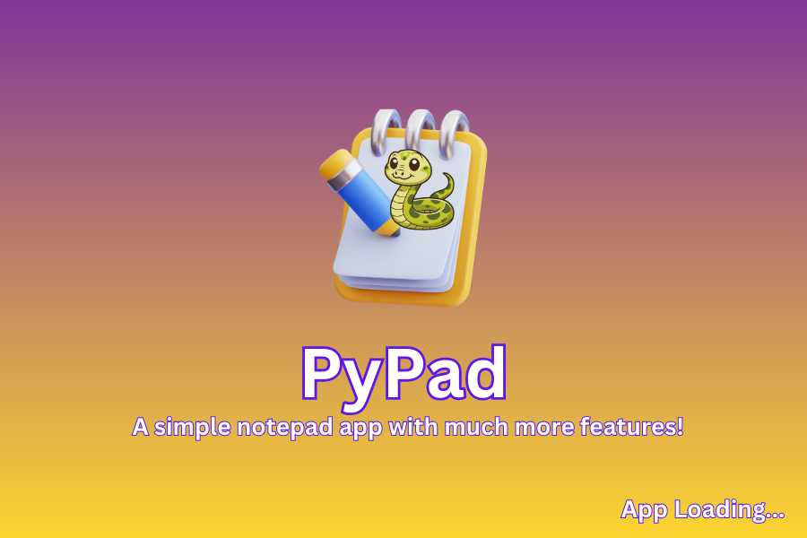
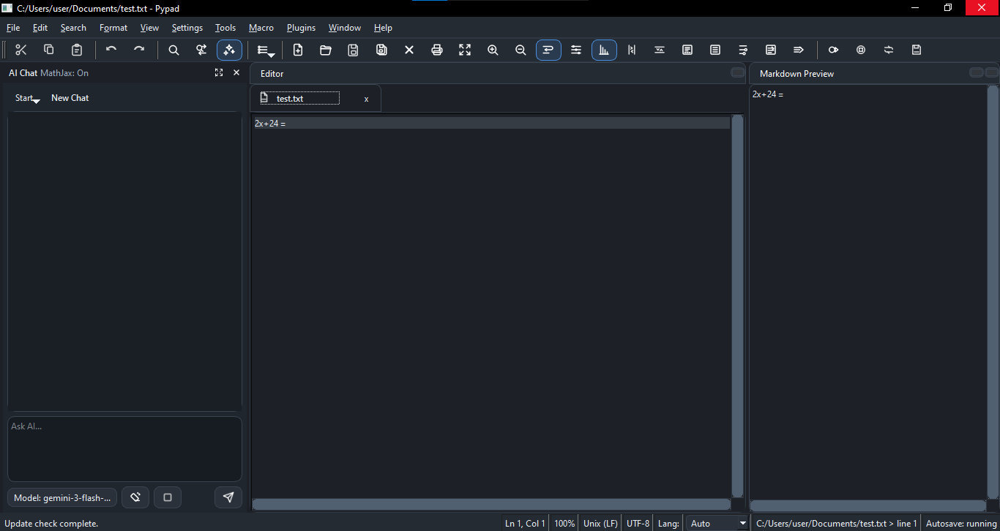
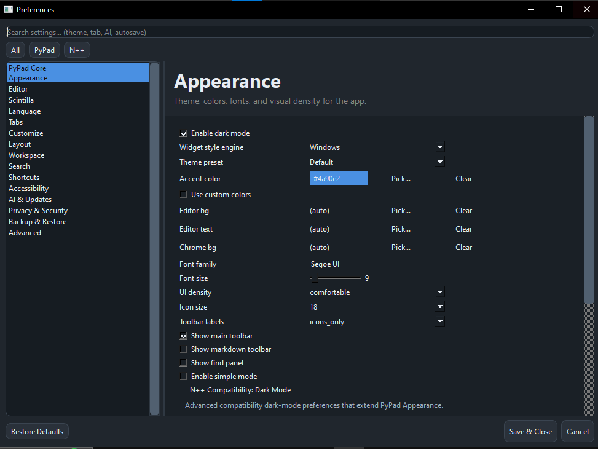

# Pypad

Pypad is a PySide6 desktop text editor built for fast note-taking, multi-tab editing, workspace navigation, and power-user workflows.

## How The App Works

Pypad starts from [`src/run.py`](/c:/Users/user/Downloads/py/RawAPPS/test/notepadclone/src/run.py). The launcher prepares runtime paths, configures logging, installs crash and Qt diagnostic hooks, loads splash assets, and then calls [`pypad.app.main()`](/c:/Users/user/Downloads/py/RawAPPS/test/notepadclone/src/pypad/app.py).

The main desktop window is the `Notepad` class in [`src/pypad/ui/main_window/window.py`](/c:/Users/user/Downloads/py/RawAPPS/test/notepadclone/src/pypad/ui/main_window/window.py). It restores settings and session state, initializes workspace and autosave controllers, builds the editor UI, and reveals the window only after startup work is ready.

At a high level, the runtime flow is:

1. `src/run.py` configures the environment and startup diagnostics.
2. Qt creates the application and splash screen.
3. `pypad.app.main()` constructs the `Notepad` main window.
4. The main window restores settings, tabs, workspace state, and timers.
5. The editor UI becomes visible and background services continue managing autosave, recovery, updates, and optional AI tools.

## Core Workflow

### Launch

Run the app in development with:

```powershell
python src/run.py
```

Windows Explorer shell integration is also supported:

```powershell
python src/run.py --register-shell-menu
python src/run.py --unregister-shell-menu
```

### Main Window

The main window combines several responsibilities into one desktop app shell:

- tabbed file editing
- menus, toolbars, docks, and status widgets
- workspace browsing and search
- settings and theme application
- autosave, recovery, and local history
- optional AI/chat actions

### Editing Engine

Pypad uses Scintilla-style editing behavior for advanced text operations. When native Scintilla is unavailable, it falls back to the compatibility editor in [`src/pypad/ui/editor/scintilla_compat/editor.py`](/c:/Users/user/Downloads/py/RawAPPS/test/notepadclone/src/pypad/ui/editor/scintilla_compat/editor.py).

That layer recreates features such as:

- syntax highlighting
- line numbers and editor margins
- code folding
- brace matching
- multiple selections and column editing
- indicators, annotations, and hotspots
- auto-completion and Scintilla-like command handling

### Files, Sessions, and Recovery

Pypad is designed to keep work recoverable:

- autosave is enabled by default
- crash snapshots and recovery data are persisted
- recent files and session state are stored
- the last session can be restored on startup
- file metadata such as encoding, EOL mode, tags, and favorites is tracked in settings

### Workspace Mode

A workspace is an optional root folder used for project-style workflows. Once a workspace is set, the app can:

- list workspace files
- search across workspace files
- save and reload workspace profiles
- feed workspace snippets into AI-assisted actions

Workspace behavior is coordinated by [`src/pypad/ui/workspace/workspace_controller.py`](/c:/Users/user/Downloads/py/RawAPPS/test/notepadclone/src/pypad/ui/workspace/workspace_controller.py).

### AI and Assistant Features

Pypad includes an AI chat dock that can work with the current file, selected text, or workspace snippets. The app also enforces privacy and trust rules so AI actions can be restricted for untrusted files or private-mode sessions.

Main AI UI code lives in [`src/pypad/ui/ai/ai_chat_dock.py`](/c:/Users/user/Downloads/py/RawAPPS/test/notepadclone/src/pypad/ui/ai/ai_chat_dock.py).

### Settings System

Default settings are defined in [`src/pypad/app_settings/defaults.py`](/c:/Users/user/Downloads/py/RawAPPS/test/notepadclone/src/pypad/app_settings/defaults.py). They cover appearance, shortcuts, autosave, recovery, workspace limits, plugin policy, AI behavior, updates, privacy, and logging.

Saved settings are merged with these defaults so the app can add new options without breaking existing user configuration.

## Project Status

PyPad is currently released and under active development. Some features are experimental and may change as the editor evolves.

Development happens during free time, so updates may be irregular.

## Features

- Fast multi-tab editing
- Quick Open (`Ctrl+Alt+P`) for files, symbols, and commands
- Command Palette (`Ctrl+Shift+P`) for quick commands
- AI assistant dock with apply actions
- Markdown preview and tools
- Autosave and crash recovery
- Workspace search and workspace file browsing
- Token-based UI theming

## Feature Areas

- Editing: tabs, navigation, Scintilla-style commands, markdown tools, syntax-aware behavior
- Productivity: autosave, recovery, reminders, quick open, session restore
- Workspace: file browsing, project search, profiles, workspace-aware assistant actions
- Appearance: token-based themes, editor/chrome colors, density controls, accessibility settings
- Safety: privacy lock, trust policies, guarded AI behavior, update-policy controls

## Goals

The long-term goals of PyPad include:

- Build a fast and reliable desktop editor for everyday writing and coding
- Provide powerful navigation tools for large projects
- Keep the UI customizable through token-based theming
- Expand AI-assisted workflows while keeping the editor lightweight
- Maintain a clean architecture that is easy to extend

## Preview

*The picture below does not reflect on the actual app experience as the app UI layout can be updated anytime.*

### Splash


### Main Window


### Settings Dialog


## Install / Run

- Development entry point: `src/run.py`
- Build script: `compile.bat`
- Version file: `assets/version.txt`
- Installer artifacts when built: `dist/installer/`

## Key Paths

- App bootstrap: `src/run.py`
- Top-level app entry: `src/pypad/app.py`
- Main window: `src/pypad/ui/main_window/window.py`
- Theme tokens / chrome QSS: `src/pypad/ui/theme_tokens.py`
- Dialog theming helpers: `src/pypad/ui/dialog_theme.py`
- AI chat dock: `src/pypad/ui/ai_chat_dock.py`
- Quick Open dialog: `src/pypad/ui/quick_open_dialog.py`
- Settings dialog: `src/pypad/ui/main_window/settings_dialog.py`
- Workspace controller: `src/pypad/ui/workspace/workspace_controller.py`
- Settings defaults: `src/pypad/app_settings/defaults.py`
- Scintilla compat editor: `src/pypad/ui/editor/scintilla_compat/editor.py`
- Update feed metadata: `update.xml`

## Developer Notes

- Plugin system overview: `docs/plugins.md`
- Plugin runtime architecture and event flow: `docs/plugin_runtime.md`
- Plugin API and hook reference: `docs/plugin_api.md`
- Scintilla compat contract overview: `docs/scintilla_parity.md`
- Generated compat command reference: `docs/scintilla_compat_reference.md`
- Repo surface audit: `python scripts/audit_scintilla_compat.py`
- Capture compat contract baseline: `python scripts/capture_scintilla_compat_contract.py`
- Regenerate compat reference docs: `python scripts/generate_scintilla_compat_docs.py`

## UI Test / Visual Regression Commands

- Fast UI checks: `powershell -File scripts/run_ui_checks.ps1 -Fast`
- Runtime smoke: `powershell -File scripts/run_ui_checks.ps1 -Runtime`
- Visual smoke baseline compare: `powershell -File scripts/run_ui_checks.ps1 -Visual`
- Update visual baseline: `powershell -File scripts/run_ui_checks.ps1 -Visual -UpdateVisualBaseline`

## Notes

- `tests/visual_smoke_phase2_baseline.json` is the committed visual baseline used by CI.
- `tests_tmp/visual_smoke_phase2/index.html` is generated during visual smoke runs for quick review.

## Credits

OpenAI Codex is used as a productivity tool during development, while implementation decisions and coding work still require direct engineering judgment.
